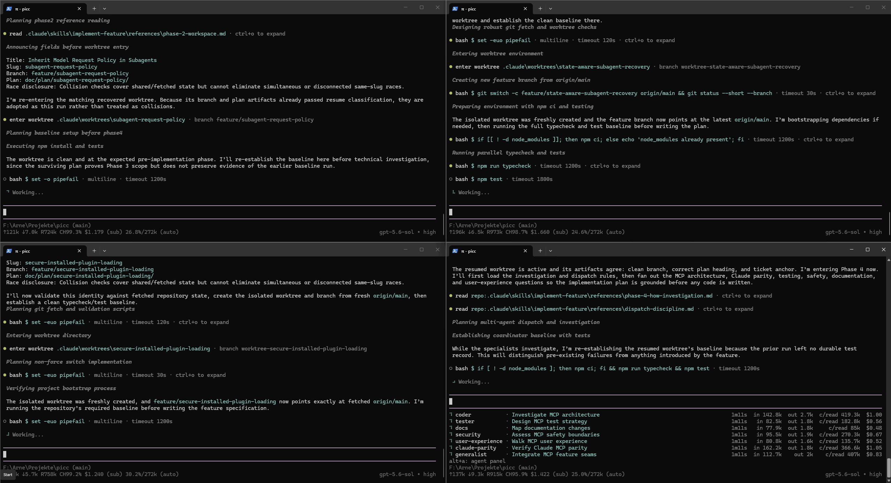

# PiCC

[](https://github.com/ArneDeutsch/PiCC/actions/workflows/ci.yml)
[](LICENSE)

**Run projects built for Claude Code — unchanged — on GPT/Codex models, from your ChatGPT
subscription.**

Many projects carry a `.claude/` corpus: `CLAUDE.md` hierarchies, skills, subagents,
`settings.json` permissions and hooks, rules, and workflows that rely on worktree isolation and
parallel sessions. PiCC is an agentic harness that reads and honors those Claude-format
artifacts natively on GPT models, with **no changes to the target project**.

It is built as an extension bundle on [Pi](https://github.com/earendil-works/pi) (MIT), which
already solves the two hardest problems — spending a ChatGPT/Codex subscription and abstracting
the model provider. PiCC adds the Claude Code compatibility layer on top.



## Quick start

Install and link a source checkout with one setup command:

```powershell
git clone https://github.com/ArneDeutsch/PiCC.git
cd PiCC
npm run setup

cd <path-to-your-claude-code-project>
picc
# /login  → ChatGPT Plus/Pro (Codex subscription)   (one-time)
# /model  → pick a GPT model
# /doctor → review this project's compatibility findings
# work as you would in Claude Code: /your-skill, subagent fan-outs, worktrees…
```

`npm run setup` installs the locked dependencies, builds and verifies the runtime for this
checkout, then globally links it. It requires a writable npm global prefix; the user guide gives a
no-global-link alternative. Windows notes: Git Bash (from Git for Windows) must be installed; if
PowerShell blocks the `picc` script shim, use `picc.cmd` or
`Set-ExecutionPolicy -Scope CurrentUser RemoteSigned`. Details per shell/OS in the guide.

Once published, `npm install --global picc` gives you the same `picc` command without a source
checkout. Published installations run verified JavaScript and fail with owner-aware repair guidance
instead of falling back to TypeScript. Source checkouts retain an explicit development fallback;
see [Install and runtime selection](doc/user-guide.md#2-install).

**→ Full documentation: [doc/user-guide.md](doc/user-guide.md)** ·
[Architecture](doc/architecture.md) · [Supported features](doc/supported-features.md) ·
[Testing](doc/testing.md) · [Contributing](CONTRIBUTING.md)

## What it does

- **Skills** — `.claude/skills` and legacy `.claude/commands`, with progressive disclosure,
  argument substitution, and shell injection.
- **Subagents** — `.claude/agents/*.md` and the built-in agent types, with description-driven
  routing, parallel background fan-out (nesting is opt-in via `subagents.maxDepth`), per-agent
  tool gating, and worktree isolation.
- **Subagent observability** — a live status panel of the whole agent tree with a drill-down per
  agent (prompt, structured live detail, final answer, stop/dismiss/steer), plus condensed,
  expandable per-agent records in the chat transcript.
- **Worktrees** — `EnterWorktree`/`ExitWorktree` with a real session-cwd swap and a
  Windows-tolerant lifecycle, for parallel sessions on one repo.
- **Hooks** — command hooks with Claude's stdin-JSON/stdout-decision contract and matcher
  semantics; see the capability matrix for compact lifecycle limits.
- **CLAUDE.md, memory & rules** — the ancestor hierarchy, recursive `@import` (the AGENTS.md
  bridge), auto memory, and `.claude/rules/`.
- **Settings & permissions** — `settings.json` precedence and merge semantics, with `deny` rules
  as a hard block.
- **MCP servers** — native user/local and project-configured stdio or selected remote HTTP/SSE
  servers expose tools, user-invoked prompts, and model-facing resources with source-specific
  approval and disablement; see the [capability matrix](doc/supported-features.md) for exact limits.
- **Compaction resilience** — proactive checkpointing on supported model transports, with
  instruction preservation and bounded recovery; see the [user guide](doc/user-guide.md).
- **Plugins** — read-only local inventory and diagnostics accompany exact installed-state loading;
  see [Installed plugins](doc/user-guide.md#installed-plugins).
- **Images & notebooks** — `Read` delivers image files and cell-aware `.ipynb` output (plots
  included) as real image blocks on a vision-capable model, degrading to a text placeholder on a
  non-vision model; notebooks can be edited cell-by-cell with `NotebookEdit`; a genuinely unsupported
  binary (e.g. a PDF) returns a clean binary error.
- **Git commits** — nudges richer, repo-style-matching commit messages by default.

Everything unrecognized degrades safely instead of crashing (the completeness floor).
The full, always-current compatibility matrix is in
[doc/supported-features.md](doc/supported-features.md).

## Control surface

Inside a session: `/skills` and `/agents` list the loaded corpus; `/doctor` gives an explicit
project compatibility report; `/mcp` shows bounded read-only MCP server status; `/usage` reports a
per-subagent token/cost breakdown; `/quota` reports provider quota headers; `alt+a` opens the
subagent status panel.
Eligible user-invocable skills whose names do not conflict with built-ins appear in the `/`
autocomplete menu. Model and per-model steering are
configured outside the project — see the [user guide](doc/user-guide.md#5-control-surface-project-external).

## Repository layout

| Path | Contents |
|---|---|
| `src/` | The harness: loaders (`claude/`), engines (`engine/`), Pi runtime layer (`runtime/`), capability registry (`registry/`), extension entry (`index.ts`) |
| `bin/picc.mjs` | Launcher (Pi + extension preloaded) |
| `examples/hello-claude` | Minimal demo project |
| `examples/full-surface` | Larger fixture exercising a broad slice of the feature surface |
| `test/` | Unit, offline-integration, and live e2e tests (vitest) — see [doc/testing.md](doc/testing.md) |
| `doc/` | [User guide](doc/user-guide.md), [architecture](doc/architecture.md), [supported features](doc/supported-features.md), [testing](doc/testing.md), and the pinned [Pi contracts](doc/pi-integration.md) |

## Development

```bash
npm run typecheck:all    # strict TS over src + tests
npm test                 # unit lane (same as test:unit)
npm run test:integration # offline whole-extension integration lane
npm run test:e2e         # packaged, compiled real-Pi, and source-fallback witnesses
npm run test:all         # unit + integration + e2e
npm run gen:capabilities # regenerate doc/supported-features.md from the registry
```

Support claims are pinned to a **Claude Code ~2.1.x (mid-2026)** baseline in the capability
registry (`src/registry/capability-registry.ts`); the runtime compatibility report is generated
from it, so docs and behavior cannot drift. See [CONTRIBUTING.md](CONTRIBUTING.md).

## License

[MIT](LICENSE)
